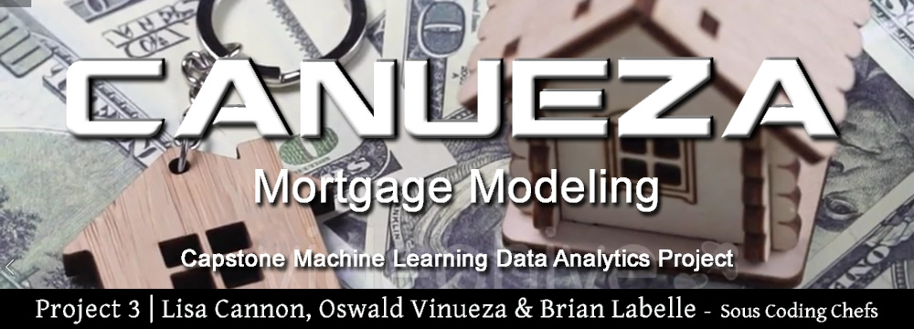
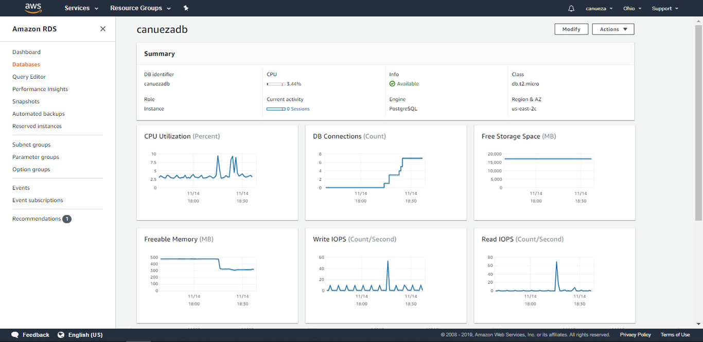
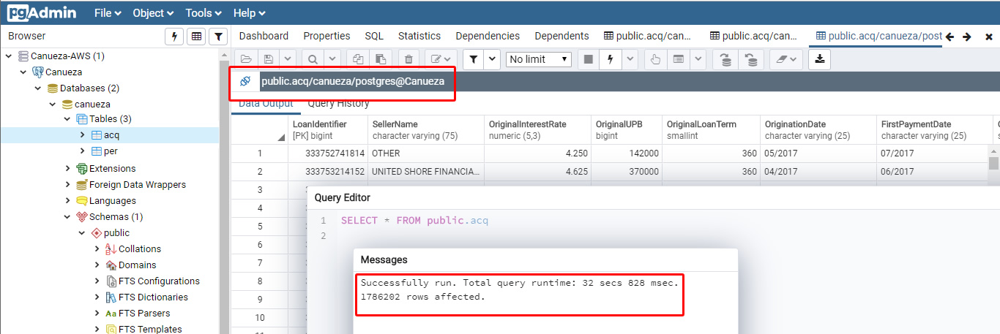

# Project 3: Mortgage Modeling




## Team members: Lisa Cannon, Oswald Vinueza, Brian Labelle, 
## Technical Consultant: xxxxxxxxxxxx

# Data:
Fannie Mae Single-Family Acquisition and Performance data.
Files are released quarterly but contain monthly information. Each of the quarterly files (Acquisition and Performance) contains information on loans that originated in that quarter and all history to the most recent quarter.
Fannie Mae is the nickname of FNMA, the Federal National Mortgage Association. Fannie Mae was established in 1938 by congress as part of the New Deal to stimulate the housing market by making mortgage more attainable for low- and middle-income families. Fannie Mae does not originate loans, but it does back or guarantee them.

# Goal:
The goal of this project is to use Fannie Mae’s mortgage performance data to make predictions about a given customer. We want to forecast 1. the probability a borrower will go into default in the next quarter, 2. the probability a borrower will not pay their next mortgage payment, 3. how long until a borrower goes into default, and 4. how these trends vary geographically.

	Proposed Methods:
	
	1. The probability a borrower will go into default in the next quarter.
		a. Logistic regression on default indicator
		b. Other ML techniques
		c. Automate selecting best model—display optimal model, graphics relevant to chosen model
		d. Chose state to build state level model
	
	2. The probability a borrower will not pay their next mortgage payment.
		a. Logistic regression on missed payment indicator
		b. Other ML techniques
		c. Automate selecting best model—display optimal model, graphics relevant to chosen model
		d. State level
	
	3. How long until a borrower goes into default.
		a. Hazard model
		b. State level
	
	4. Forecast Visualization: Enter your info and get probability of default and time to default.
	
	5. Map Visualization: How these trends vary geographically.
	
	
# Inspiration:
Lorem ipsum dolor sit amet, consectetur adipiscing elit, sed do eiusmod tempor incididunt ut labore et dolore magna aliqua. Ut enim ad minim veniam, quis nostrud exercitation ullamco laboris nisi ut aliquip ex ea commodo consequat. Duis aute irure dolor in reprehenderit in voluptate velit esse cillum dolore eu fugiat nulla pariatur. Excepteur sint occaecat cupidatat non proident, sunt in culpa qui officia deserunt mollit anim id est laborum.

 
# Conclusion:
```
Lorem ipsum dolor sit amet, consectetur adipiscing elit, sed do eiusmod tempor incididunt ut labore et dolore magna aliqua. Ut enim ad minim veniam, quis nostrud exercitation ullamco laboris nisi ut aliquip ex ea commodo consequat. Duis aute irure dolor in reprehenderit in voluptate velit esse cillum dolore eu fugiat nulla pariatur. Excepteur sint occaecat cupidatat non proident, sunt in culpa qui officia deserunt mollit anim id est laborum.
```

# What’s next for analysis?:   
```
Lorem ipsum dolor sit amet, consectetur adipiscing elit, sed do eiusmod tempor incididunt ut labore et dolore magna aliqua. Ut enim ad minim veniam, quis nostrud exercitation ullamco laboris nisi ut aliquip ex ea commodo consequat. Duis aute irure dolor in reprehenderit in voluptate velit esse cillum dolore eu fugiat nulla pariatur. Excepteur sint occaecat cupidatat non proident, sunt in culpa qui officia deserunt mollit anim id est laborum.

```

-----------------------------------------------

# Data Management / Cleaning / Flask Coding



AWS RDS was chosen based on the amount of data that we would need to house & run through our machine learning models. The free tier Amazon Linux AMI 2018.03.0 (HVM) was selected based on the default image includes AWS command line tools, Python, Ruby, Perl, and Java. The repositories include Docker, PHP, MySQL, PostgreSQL, and other packages.



# Python Flask coding: 
Created the framework of the app.py, template/index.html, static/js/app.js files to connect to the ProgresSQL database and create a hello world template to build on.  

# Time Series Visualization:  
Created drop downs to allow a user to choose a vaccine and a country.  Pulled and filtered, creating a path to store jsonified data.  Generated Plotly time series line graphs of filtered data.

# Analysis:  
As with the time series visualization, drops downs allowed the user to choose a vaccine and country, and the filtered data was store in a path defined in app.py. Conducted regression analysis on the filter data in python using SciPy. Defined a path in app.py to store jsonified regression analysis results. Regression fitplot and related plots to check assumptions were created using Plotly.  Provided description of regression analysis to add to webpage.

-----------------------------------------------

# TECHNOLOGY UTILIZED:


### Prerequisites

```
python-3.6.2
Flask-PyMongo 2.3.0
Flask-SQLAlchemy 2.4.0
gunicorn 19.9.0
Jinja2 2.10.1
psycopg2 2.8.3
SQLAlchemy 1.2.19
gunicorn 19.9.0
```

### Collaborative Coding Environment

Python code was developed mainly utilizing Microsoft Visual Studio with Python Flask. 
4 app.py were created to manage 9 different visualizations. ( map visualizations were not completed.) 


	* Canuezatrend.herokuapp.com | World Immunization Trend Chart
			- Vaccination Coverage 
			- Life Expectancy / Infant Mortality 

	* Canuezalife.herokuapp.com | Life Expectancy Regression
			- Life Expectancy Linear Regression Fit
			- Life Expectancy Normal Q-Q Plot
			- Life Expectancy Residual Plot
			
	* Canuezainfant.herokuapp.com | Infant Mortality Regression
			- Infant Mortality Linear Regression Fit
			- Infant Mortality Normal Q-Q Plot
			- Infant Mortality Residual Plot
			
	* Canueza2.herokuapp.com | World Immunization Progress Chart
			- main app.py to launch the main UI Web App

	* Canueza.herokuapp.com | World Immunization Progress Chart
			- original heroku web app that still 
				- houses 70k rows of PostGres Unicef Data
				- lat long data by country for potential map visualizations
				

( kindly note that Canueza.herokuapp.com is broken from any future UI updates because of some sort of conflict)	


# Aux Web pages.

To fully round out the application, additional content was generated:

 - a brief history of the Timeline / History of Vaccines  ( http://Canueza2.herokuapp.com/static/project-history.html )
 - abridged content about the back story of Project 2 ( http://Canueza2.herokuapp.com/static/project-Canueza.html )


## Deployment

Due to the time constraints to get 4 different app.py applications to function on Heroku, it was decided to modularize and setup 1 heroku per app.py and inter-connect them utilizing the hub & spoke philosophy. The theory was that at least we could build on the success as each app.py was deployed as compared to having a single 600+ line of code in a single app to mitigate troubleshooting python code on an unknown Heroku platform and easily bolt on additional visualization as time permitted.


## Tools that were used to built this project:
```
* Visual Studio Code v1.39.2 - code development
* Adobe DreamWeaver v19.2.1 - Management & development of HTML files.
* Postgres pgAdmin v4.9 - SQL Table creation on Heroku
* Adobe Fireworks CS6 - Graphic editing

* Adobe Premiere Rush v1.2.8 - Video editing
* WinMerge v2.16.4 - easy side by side code comparison
* GitHub Desktop v2.2.1 - sharing code

* Heroku - Platform as a Service - hobby basic plan for 10,000,000 rows of data.
* Heroku - PostGres Add-on v11 Data Store

* Ashton Responsive HTML Template from Theme Forest ( Envato.com )
* several video files from Envato.com
```

### Not Included in this project but were planned.
	* [HighCharts.com](https://www.highcharts.com/maps/demo/all-maps)
	* Heroku Dataclips : SQL
	* Heroku Dataclips : JSON
	

# Heroku - Future Development


An attempt was made to leverage the Heroku platform by using it’s "add on" data store and other misc technologies. From a project software architecture perspective, it was thought that exploiting the built in JSON URL feature would be extremely a great future enhancement. Due to time limitation and complexity of back engineering the highcharts.com technology, Canuezamaps.herokuapp.com was never completed. 


The idea was to write SQL code utilizing latitude and longitude data via a primary key of Country Name to  with the UNICEF data to possibly display the vaccinated populate versus the total population and / or many other possible types of mapping visualizations. 


Priority was set to ensure that the primary data analytics charts were successfully being displayed and the maps would be secondary if time permitted. Several attempts with our technical consultant was made to integrate the JSON URL with the HighCharts.com all maps.

https://www.highcharts.com/maps/demo/all-maps


## Links

 http://www.canueza.com/


